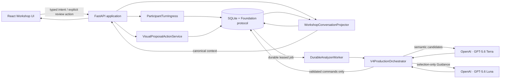

# SpecOps

SpecOps turns ambiguous product and technical documents into a governed, evidence-linked specification through a structured workshop.

The current product is a V0 text-authoritative Workshop: a participant chats with Luna, Terra analyzes each committed answer, and the deterministic Foundation owns every identity, revision, proposal decision, artifact, audit, and completion transition. Model output is always a candidate; it never becomes authoritative until Foundation validates and admits it.

This README describes the product code on `feature/v0-preparation-runway` at baseline commit `7a1a5fa`.

## Current product

Working today:

- A compact, scrollable Luna chat with the current question and participant composer in one pane.
- Paid document preparation using a stored OpenAI Conversation and two uploaded project documents.
- An exact initial runway of four Foundation-admitted questions.
- Typed `CHAT` responses committed through one idempotent ingress.
- One-turn-at-a-time analysis: a second submission waits while the previous turn is being analyzed.
- Terra/medium for document bootstrap, turn analysis, artifact synthesis, narration, and audit work.
- Luna/medium for stateless, selection-only Guidance over question references already admitted by Foundation.
- Explicit visual proposal controls: Confirm, Edit, and Reject.
- A clear clarification-only outcome when analysis completes without producing a proposal.
- Deliberate Finish behavior that requires at least one committed turn and no pending proposal.
- Durable SQLite reconstruction across refresh and server restart.
- Tracked provider files, Conversations, and Responses with completion/disconnect cleanup.
- Exact-text playback as an optional output aid; it has no input or authority.

Deliberately out of scope for V0:

- Microphone, ASR, continuous voice, or voice-confirmed input.
- Multi-user authentication, tenant management, or arbitrary project selection.
- Jira or GitHub delivery from the Workshop runtime.
- Browser-side model calls or browser-held provider credentials.

The current demo uses one fixed participant identity and one configured Workshop case. It is a focused prototype, not a production multi-tenant service.

## Architecture



### Responsibility boundaries

| Component | Owns | Must not own |
|---|---|---|
| React UI | Chat presentation, local draft text, explicit participant actions | Canonical state, model calls, proposal authority |
| FastAPI | HTTP/WebSocket boundary, DTO validation, content-safe errors | Semantic authority |
| Participant ingress | Idempotent typed-turn transaction, question binding, transcript evidence, Analyzer job creation | Semantic interpretation |
| Durable worker | Job leasing, resume, bounded retry/failure handling | Business decisions |
| Terra adapter | Structured semantic candidates for bootstrap, analysis, synthesis, and audit | Identity, acceptance, readiness, completion |
| Luna provider | Select/order supplied askable question references | Authoring canonical questions or mutating evidence |
| Foundation protocol | Identity, revision, evidence, admission, governance, audit, readiness, handoff | Provider inference |
| Conversation projector | Read-only canonical participant view | Mutation |

### Preparation flow

1. Register the fixed case, delegation, and source identities.
2. Upload the PM Spec and Technical Contract to OpenAI.
3. Create one stored provider Conversation.
4. Run one Terra `BOOTSTRAP` request.
5. Validate the strict candidate and admit the Analyzer context and interview brief through Foundation.
6. Expose exactly four canonical questions and mark preparation `READY`.

Preparation resource identities are checkpointed in SQLite before later work proceeds. Confirmed resources are cleaned after completion or the bounded last-client disconnect lifecycle. Uncertain deletion outcomes fail closed instead of pretending cleanup succeeded.

### Workshop turn flow

1. The browser submits a typed response bound to the exact question ID and version.
2. `ParticipantTurnIngress` atomically commits transcript evidence, consumes the question, advances the case revision, and queues `TURN_ANALYSIS`.
3. Send is unavailable while that analysis is pending; local drafting remains possible.
4. Terra returns semantic candidates. Foundation validates references and admits only supported findings, problems, questions, and decision proposals.
5. When runway policy triggers Guidance, Luna may select only from Foundation-supplied askable references.
6. The UI reconstructs the canonical context. A proposal requires an explicit Confirm, Edit, or Reject action.
7. If analysis yields no proposal but a revised question exists, the UI explains that Luna needs another clarification and follows the question into view.

### Completion flow

Finish is a separate participant action. It is rejected for an untouched Workshop, stale revision, or pending proposal. The completion pipeline synthesizes the current Spec from confirmed evidence, applies Foundation admission and quality gates, records the completion receipt, projects `HANDOFF_READY`, and schedules provider-resource cleanup.

The case revision shown in the UI is a monotonic concurrency version. It counts admitted state changes—not questions or model calls—and prevents stale actions from overwriting newer state.

## Repository layout

```text
frontend/                         React, TypeScript, Vite, Vitest, Playwright
migrations/                       Additive SQLite/Alembic migrations
scripts/                          Contract generation and release verification
src/specops_contracts/            Strict DTOs, JSON Schemas, quality contract
src/specops_workflow/             Deterministic Foundation and persistence
src/specops_workshop/api.py       Production FastAPI composition root
src/specops_workshop/chat_*       Text Workshop ingress, projection, Luna adapter
src/specops_workshop/v4/          Terra adapter, orchestrator, scheduler, quality path
tests/workshop/                   Protocol, runtime, provider, UI, and recovery evidence
```

The Workshop also expects its project documents from the adjacent Spec Engineering workspace used by `SourceCatalog`. Those source documents and live runtime databases are intentionally not embedded in this repository.

## Requirements

- Python 3.12
- Node.js and npm
- SQLite
- OpenAI API credentials only for a real Workshop

Install the backend and test dependencies:

```bash
python3.12 -m venv .venv
.venv/bin/pip install -e '.[test,workshop,workshop-test]'
```

Install the frontend:

```bash
cd frontend
npm install
cd ..
```

## Configuration

The real application requires a server-only environment file containing:

```text
SPECOPS_DATABASE_URL
WORKSHOP_DATABASE_URL
OPENAI_API_KEY
```

The pinned defaults are:

```text
OPENAI_ANALYZER_MODEL=gpt-5.6-terra
OPENAI_CHATBOT_MODEL=gpt-5.6-luna
OPENAI_ANALYZER_REASONING_EFFORT=medium
OPENAI_CHATBOT_REASONING_EFFORT=medium
```

`GEMINI_API_KEY` is optional and unused by the text-authoritative V0 path. Point `SPECOPS_ENV_FILE` at the environment file; if it is unset, the server looks for `.env` in the adjacent Spec Engineering workspace. The Workshop rejects any `JIRA_*` or `GITHUB_*` entry because external delivery is outside this runtime boundary. Secrets must remain server-side and must not be committed.

## Run locally

Create a dedicated, uncommitted Workshop environment file with isolated SQLite databases:

```dotenv
SPECOPS_DATABASE_URL=sqlite:///./specops-workshop.sqlite
WORKSHOP_DATABASE_URL=sqlite:///./workshop-sessions.sqlite
OPENAI_API_KEY=...
```

Then point the server at that file, build, and serve:

```bash
export SPECOPS_ENV_FILE='/absolute/path/to/.env.workshop'
make dev
```

Open <http://127.0.0.1:8000>.

> **Paid-operation warning:** a fresh real runtime can upload the two configured project documents and execute OpenAI requests. Use a new isolated database, obtain the required data-transfer authorization, and retain the cleanup receipt. Do not use `make dev` as a no-cost smoke test.

## Verification

Run the complete deterministic, no-provider release gate:

```bash
PYTHONPATH=src .venv/bin/python scripts/verify_workshop_release.py
```

Or run the layers independently:

```bash
PYTHONPATH=src .venv/bin/pytest -q
cd frontend && npm test
cd frontend && npm run build
cd frontend && npm run test:e2e
cd frontend && npm run test:e2e:real
```

At `7a1a5fa`, the verified deterministic bar is:

- 364 backend tests passed.
- 7 Vitest checks passed.
- Frontend production build passed.
- 22 Playwright checks passed across desktop and narrow viewports.
- 1 real built-frontend-to-FastAPI browser seam passed.
- Provider calls, tokens, and cost for the deterministic gate: zero.

## Current evaluation status

A manual V0 demo cycle has been observed working, including typed chat and explicit proposal handling. That is useful product evidence, but it is not a replacement for the formal credentialed scorecard.

The remaining focused evaluation is `SW-EV-024`: one complete real Workshop must prove, in a single run, Luna Guidance, Terra analysis, explicit proposal confirmation, Spec synthesis and admission, quality audit, Finish, `HANDOFF_READY`, usage receipts, and provider cleanup.

The latest scored Run 19 reached Guidance and confirmation but Terra's Spec synthesis Response ended `incomplete` before a candidate existed. Consequently, schema admission, audit, and handoff were not reached. The historical reason is unrecoverable because its provider objects were correctly deleted.

The separate branch `debug/run19-incomplete-reason` contains commit `4b0c835`, which retains only the provider's bounded `max_output_tokens` or `content_filter` reason in lifecycle telemetry. That diagnostic is tested but is not yet integrated into `feature/v0-preparation-runway`.

No README statement should be interpreted as a full production-readiness claim until `SW-EV-024` passes end to end.

## Deterministic Foundation example

The original headless policy kernel remains independently executable:

```bash
.venv/bin/python examples/anonymous_workflow.py
```

It creates an anonymous case, exercises authority rejection, registers evidence, builds and approves the governed package and projection artifacts, and reads the resulting workflow state without making network requests.
