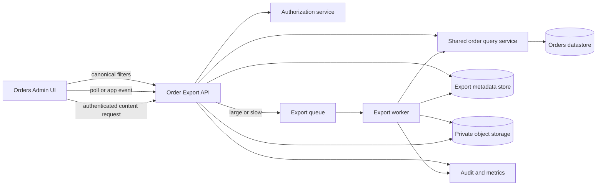

# Filtered Orders CSV Export - Technical Specification

**Product:** Orders Admin<br>
**Feature:** Export filtered orders to CSV<br>
**Document status:** Draft for PM-Engineering contract discussion<br>
**Technical owner:** Unassigned<br>
**Product owner:** Unassigned<br>
**Schema contract:** `orders-csv.v1`<br>
**Last updated:** 2026-08-02

## 1. Purpose of this document

This is the engineering pre-read for finalizing the product specification and technical contract. It translates the business specification into proposed system behavior, interfaces, security rules, data guarantees, failure semantics, and implementation units.

Items marked **Proposed** are the Dev Lead recommendation. Items marked **PM decision** need product confirmation. Items marked **Engineering validation** require codebase, data-volume, or infrastructure evidence before the contract is signed.

## 2. Executive recommendation

Implement exports as a single export-resource workflow:

1. The browser submits the active, canonical filter state to `POST /api/v1/order-exports`.
2. The service validates authorization, normalizes the filters, captures the export snapshot, and creates an `OrderExport` resource.
3. If the export can be generated within the inline budget, the resource returns as `completed` and the browser starts the download immediately.
4. Otherwise the same resource returns as `queued` or `running`, a worker completes it asynchronously, and an app-level notification exposes the download.
5. The file is downloadable only through an authenticated endpoint that rechecks permission and authorization scope.

The 10,000-row threshold changes processing mode; it is not a row cap. A file is made visible only after generation, row-count verification, and checksum calculation succeed.

### Recommended contract defaults

| Topic | Proposed default | Status |
|---|---|---|
| Date field | Order creation timestamp (`created_at`) | PM decision |
| Date range | Inclusive local calendar dates, converted to `[start, next-day-start)` instants | Proposed |
| Timezone | Organization IANA timezone; UTC fallback | Proposed, config location open |
| Customer value | Order-time customer display-name snapshot | PM decision |
| Customer filter | Stable customer ID from selector; preserve existing table semantics if text search exists | PM decision |
| Consistency | Membership and six projected values fixed at `snapshot_at` | Proposed |
| Small/large mode | Inline attempt for `<=10,000` rows with a 3-second server budget; otherwise async | Engineering validation |
| Business maximum | No product cap initially; operational safety limit only after measured capacity testing | Proposed |
| File encoding | UTF-8 with BOM for Excel compatibility | PM/consumer decision |
| Line endings | CRLF | Proposed |
| Formula defense | Prefix dangerous text cells with an apostrophe | Proposed |
| Retention | File: 24 hours; audit metadata: 90 days or policy minimum | Security/compliance decision |
| Completion notice | Persistent in-app notification; no export-history page | PM decision |
| Download access | Initiating user only, with live `orders.export` and unchanged authorization scope | Proposed |

## 3. Scope and boundaries

### 3.1 In scope

- Exporting every order that matches the captured date, status, customer, tenant, and access-scope filters.
- Fixed six-column `orders-csv.v1` schema.
- A common query definition used by the table count and export.
- Inline completion for small/fast exports and queued generation for large/slow exports.
- Authenticated download, expiry, audit, progress, retry, and actionable failure states.
- CSV correctness, Unicode, spreadsheet formula defense, and protection of large identifiers.

### 3.2 Out of scope

- Selected-row export, configurable columns, saved/scheduled exports, multiple formats, import, and a dedicated export-history page.
- Aggregate totals, currency conversion, or reconciliation calculations.
- Guaranteed delivery after the user closes the application unless PM adds email or another out-of-app channel.
- Data-warehouse extraction or a new reporting platform.

### 3.3 Capstone boundary

The capstone Orders Admin dashboard may remain a static fixture with filters, six columns, 25-row pagination, and an inactive **Export CSV** button. The implementation design below is the contract artifact used by SpecOps; building the production export flow is not required for the capstone demo.

## 4. System context



This is a logical architecture. Existing platform services should be reused. A new queue, object store, or notification technology must not be introduced if an approved equivalent already exists.

## 5. Domain contracts

### 5.1 Canonical filter object

The table, table count, and export must use the same server-owned filter type and query builder. The UI must not send page size, page number, sort order, display labels, or a client-reported result count as export authority.

```json
{
  "business_date": {
    "from": "2026-07-01",
    "to": "2026-07-31"
  },
  "statuses": ["paid", "refunded"],
  "customer": {
    "id": "cus_01J..."
  }
}
```

Contract rules:

- Omitted filter fields mean the same thing as they do in the table.
- `from` and `to` are ISO local calendar dates, not browser-local instants.
- The server resolves dates using the organization timezone captured for the export.
- `statuses` contain canonical enum values. Unknown or unauthorized status values are rejected rather than ignored.
- The preferred customer key is a stable ID. If the current table uses free-text matching, the exact normalization, collation, case, whitespace, and partial-match behavior must be moved into the shared query service before export work begins.
- Tenant and row-level visibility constraints are derived from authenticated server context, never accepted from the client.
- Pagination and current sort are excluded. Export ordering is independently deterministic.

### 5.2 Date-boundary contract

For an inclusive UI range `from=2026-07-01`, `to=2026-07-31` in `Europe/Berlin`, the query uses:

```text
business_timestamp >= start_of_day(2026-07-01, Europe/Berlin)
AND business_timestamp < start_of_day(2026-08-01, Europe/Berlin)
```

Using a half-open interval avoids fractional-second and database-precision errors. Daylight-saving transitions are resolved by the timezone library and IANA timezone data used by the backend. The resolved timezone and `snapshot_at` are stored on the export resource.

### 5.3 Deterministic order

Rows are ordered by `business_timestamp ASC, order_id ASC`. This ordering is independent of table sort and is stable across worker batches. `order_id` is the final unique tie-breaker.

### 5.4 Consistency guarantee

**Proposed contract:** exported membership and all six projected values represent one logical snapshot at `snapshot_at`, the instant the request is accepted.

Acceptable implementations, in preference order:

1. Database-native consistent snapshot that remains valid across paged reads.
2. Materialize the matching IDs and six projected values into an export staging dataset at request time.
3. A proven temporal-query mechanism that reads every value `AS OF snapshot_at`.

Keyset pagination against live mutable rows without snapshot protection is not contract-compliant because status, customer, date, or totals could change between batches and create missing, duplicate, or mixed-version rows.

If platform constraints make full snapshot semantics infeasible, PM and Engineering must explicitly replace this with a weaker named guarantee before implementation.

## 6. CSV contract: `orders-csv.v1`

### 6.1 File-level rules

| Property | Contract |
|---|---|
| Media type | `text/csv; charset=utf-8` |
| Encoding | UTF-8 with BOM, pending downstream-consumer confirmation |
| Delimiter | Comma (`,`) |
| Record ending | CRLF (`\r\n`) |
| Header | Exactly one header row |
| Quoting | RFC 4180-style: quote when a field contains comma, quote, CR, or LF; double embedded quotes |
| Data rows | Exactly one row per order |
| Empty file | Not produced by default |
| Compression | None in v1 |
| Schema version | Stored as export metadata; not added as a seventh CSV column |

### 6.2 Column-level rules

| Pos. | Header | Source and transformation | Null rule | Example |
|---:|---|---|---|---|
| 1 | `order_id` | Stable identifier serialized as text; never scientific notation | Must not be null | `00123456789012345678` |
| 2 | `order_date` | Canonical business timestamp rendered in captured timezone as ISO 8601 with seconds and numeric offset, or `Z` for UTC | Must not be null | `2026-07-04T14:32:09+02:00` |
| 3 | `customer` | Confirmed customer-name source; Unicode preserved; formula defense applied | Product decision if source value is null | `Muller & Sohne GmbH` |
| 4 | `status` | Canonical status enum, not localized display text | Must not be null | `paid` |
| 5 | `currency` | Uppercase ISO 4217 code | Must not be null | `EUR` |
| 6 | `total` | Exact decimal major-unit string; no symbol, grouping, exponent, or binary floating-point conversion | Must not be null | `1234.50` |

### 6.3 Formula-injection defense

CSV quoting alone does not prevent spreadsheet formula execution. For textual fields (`order_id`, `customer`, `status`, `currency`), if the first non-whitespace character is `=`, `+`, `-`, or `@`, prefix the exported cell with a single apostrophe. Tab, CR, LF, and other control-character prefixes must be normalized or rejected according to the shared sanitizer.

The exporter records `formula_safe_cells_count` for audit and testing. Dates and totals come from typed server values and are formatted by trusted code; they are never passed through from raw text.

This transformation slightly changes the raw CSV cell value and therefore requires PM/consumer acceptance. If byte-exact customer text is a downstream requirement, use an agreed alternative and document the spreadsheet risk.

### 6.4 Monetary formatting

No floating-point arithmetic is permitted. The final implementation must identify whether the source is:

- an exact major-unit decimal, which is serialized directly with the agreed scale; or
- an integer minor-unit amount, which is converted using the order currency's configured exponent.

Rounding during export is forbidden. If source amount and currency metadata are inconsistent, the export fails with `DATA_INTEGRITY_ERROR`; it must not guess or emit a partial file.

### 6.5 File naming

With a date range:

```text
orders_2026-07-01_2026-07-31_exported-20260802-1430.csv
```

Without a date range:

```text
orders_all-dates_exported-20260802-1430.csv
```

The exported timestamp uses the captured organization timezone, or UTC when the fallback is active. Only ASCII letters, digits, hyphens, underscores, and the `.csv` extension are permitted.

## 7. Export resource and API contract

Endpoint names are proposed and may be adapted to existing API conventions without changing their behavior.

### 7.1 Create export

`POST /api/v1/order-exports`

Headers:

```http
Content-Type: application/json
Idempotency-Key: <UUID generated per user action>
```

Request:

```json
{
  "schema_version": "orders-csv.v1",
  "filters": {
    "business_date": {"from": "2026-07-01", "to": "2026-07-31"},
    "statuses": ["paid", "refunded"],
    "customer": {"id": "cus_01J..."}
  }
}
```

Completed inline response (`201 Created`):

```json
{
  "export_id": "exp_01J...",
  "status": "completed",
  "schema_version": "orders-csv.v1",
  "snapshot_at": "2026-08-02T12:30:11Z",
  "timezone": "Europe/Berlin",
  "matched_row_count": 137,
  "generated_row_count": 137,
  "file_name": "orders_2026-07-01_2026-07-31_exported-20260802-1430.csv",
  "download_path": "/api/v1/order-exports/exp_01J.../content",
  "expires_at": "2026-08-03T12:30:11Z"
}
```

Queued response (`202 Accepted`):

```json
{
  "export_id": "exp_01J...",
  "status": "queued",
  "schema_version": "orders-csv.v1",
  "snapshot_at": "2026-08-02T12:30:11Z",
  "timezone": "Europe/Berlin",
  "matched_row_count": 48213,
  "status_path": "/api/v1/order-exports/exp_01J..."
}
```

Rules:

- The server, not the client, determines `matched_row_count`.
- A repeated request with the same idempotency key, user, and canonical body returns the original resource. Reuse with a different body returns `409 IDEMPOTENCY_CONFLICT`.
- The request checks `orders.export` and current row-level scope before the resource is created.
- Zero matches returns `422 NO_MATCHING_ORDERS`; no file resource is created.
- Above 10,000 rows is queued. At or below 10,000 rows, the service may try inline generation for at most 3 seconds, then queue the same resource without failing the request.
- A hard maximum, if later introduced, is returned explicitly with the matched count and narrowing guidance.

### 7.2 Read export status

`GET /api/v1/order-exports/{export_id}`

The response uses the same resource representation and one of these states:

```text
queued -> running -> verifying -> completed -> expired
                    \-> failed
queued/running/verifying -> cancelled (operational only in v1)
```

`progress.processed_rows` may be returned for asynchronous jobs. The UI must label it as progress, not a final count. Polling uses server-provided `Retry-After`, proposed as 2 seconds initially with backoff to 10 seconds. An existing app event or push channel may replace polling.

### 7.3 Download content

`GET /api/v1/order-exports/{export_id}/content`

Success response:

```http
HTTP/1.1 200 OK
Content-Type: text/csv; charset=utf-8
Content-Disposition: attachment; filename="orders_...csv"
Cache-Control: private, no-store
X-Content-Type-Options: nosniff
```

Download rules:

- The object store is private; an object-storage URL is never persisted or displayed as a reusable public link.
- The endpoint authenticates the caller and rechecks `orders.export` on every request.
- Only the initiating user may download in v1.
- The current tenant and authorization-scope fingerprint must match the captured fingerprint. If access changed, return `403 EXPORT_SCOPE_CHANGED` and require a new export.
- `completed` is required. Other states return the corresponding conflict, failure, or expiry error.
- The service streams only the immutable finalized object whose checksum and row count match the export metadata.
- Every successful and denied download attempt is audited.

### 7.4 Error envelope

```json
{
  "error": {
    "code": "NO_MATCHING_ORDERS",
    "message": "No orders match the captured filters.",
    "retryable": false,
    "correlation_id": "req_01J...",
    "details": {}
  }
}
```

| HTTP | Code | UI behavior |
|---:|---|---|
| 400 | `INVALID_FILTER` | Keep filters; identify invalid field |
| 401 | `AUTHENTICATION_REQUIRED` | Follow normal sign-in flow |
| 403 | `EXPORT_FORBIDDEN` | State that export permission is required |
| 403 | `EXPORT_SCOPE_CHANGED` | Explain that access changed; offer a new export |
| 404 | `EXPORT_NOT_FOUND` | Do not reveal another user's export existence |
| 409 | `EXPORT_NOT_READY` | Continue status tracking |
| 409 | `IDEMPOTENCY_CONFLICT` | Generate a new action key and retry once |
| 410 | `EXPORT_EXPIRED` | Explain expiry; offer regeneration with current filters |
| 413 | `EXPORT_TOO_LARGE` | Show matched count, hard limit, and narrowing guidance |
| 422 | `NO_MATCHING_ORDERS` | Do not download; show no-data message |
| 422 | `DATA_INTEGRITY_ERROR` | Fail export; show support-safe correlation ID |
| 429 | `EXPORT_RATE_LIMITED` | Show retry time; preserve captured request |
| 500/503 | `EXPORT_GENERATION_FAILED` | Show retry action; never expose a partial file |

## 8. Export persistence model

Minimum metadata fields:

| Field | Purpose |
|---|---|
| `export_id` | Stable opaque identifier |
| `requester_user_id`, `tenant_id` | Ownership and tenancy |
| `authorization_scope_hash` | Detect scope changes before download |
| `schema_version` | Locks output format |
| `canonical_filters_json`, `filters_hash` | Captured filter definition and audit |
| `business_timezone` | Date query and rendering context |
| `snapshot_at` | Consistency boundary |
| `status` | State machine value |
| `matched_row_count` | Server count at snapshot |
| `generated_row_count` | Verified CSV data-row count |
| `processed_rows` | Non-final progress only |
| `object_key` | Private finalized file location |
| `sha256`, `byte_size` | Integrity and operational evidence |
| `formula_safe_cells_count` | CSV-defense evidence |
| `error_code`, `correlation_id` | Support-safe failure diagnosis |
| `created_at`, `started_at`, `completed_at`, `expires_at` | Lifecycle and SLO measurement |

Raw customer names should not be duplicated into audit records. Prefer customer IDs or a redacted/hash representation consistent with security policy.

## 9. Generation algorithm

1. Authenticate the request and require `orders.export`.
2. Normalize the shared `OrderFilter`; derive tenant and row-level restrictions from server context.
3. Resolve the organization timezone; record whether UTC fallback was used.
4. Start the chosen snapshot mechanism and compute `matched_row_count` with the shared query.
5. If zero, write the denied/no-data audit event and return `NO_MATCHING_ORDERS`.
6. Create the export metadata resource and immutable snapshot reference.
7. Select inline or queued mode without changing the resource or captured filters.
8. Stream the header and rows in deterministic keyset order into a private temporary object. Never hold the full CSV in application memory.
9. Apply typed formatting, CSV escaping, and formula defense per cell.
10. Count data rows and calculate SHA-256 while streaming.
11. Verify `generated_row_count == matched_row_count`. On mismatch, mark `failed` and discard the temporary object.
12. Atomically finalize the object, then set status to `completed`. The file must not be downloadable before both operations succeed.
13. Notify the app and emit completion metrics/audit events.
14. Expire the file at `expires_at`; retain or delete metadata according to policy.

Worker retries are safe because each attempt writes to a unique temporary object and only one finalized object may be attached to the export resource. Proposed retry policy is three attempts with exponential backoff for transient infrastructure failures; validation, authorization, and data-integrity failures are not retried automatically.

## 10. Security and privacy contract

- Require `orders.export` at button capability resolution, export creation, status read, and content download. UI hiding is not an authorization control.
- Apply the same tenant and row-level constraints used by the table to both count and row retrieval.
- Bind the export to requester, tenant, filter hash, authorization-scope hash, and schema version.
- Encrypt files in transit and at rest using approved platform controls.
- Use a private bucket/container with lifecycle deletion. Do not log rows, customer names, file contents, credentials, or public object URLs.
- Return `404` for attempts to inspect an export owned by another user or tenant.
- Recheck live permission and scope on download. Permission revocation makes prior export links unusable.
- Rate-limit export creation per user and tenant. Initial limits are an Engineering/Security decision based on capacity tests.
- CSV sanitization is mandatory and tested as a security control.
- Threat-model cross-tenant identifier guessing, link sharing, formula injection, log leakage, object-store misconfiguration, queue-message tampering, and denial-of-service through broad filters.

## 11. UX behavior contract

| Condition | Required behavior |
|---|---|
| Count known to be zero | Disable **Export CSV** and provide an accessible reason |
| Request accepted and completes inline | Start authenticated download and show completion confirmation |
| Request queued | Show persistent “Preparing export” feedback; user may navigate elsewhere |
| Progress known | Show processed rows or indeterminate progress; never show an unverified final count |
| Completed asynchronously | App-level notification includes file name, row count, expiry, and Download action |
| Filters change after request | Existing export remains bound to captured filters; new UI state has no effect |
| No rows at server snapshot | Show no-data message; no download |
| Failure | Show actionable retry and correlation ID; do not offer content |
| Expired | Explain expiry and offer to create a new export from the current filters |
| Permission or scope lost | Deny download and explain that access changed |

The notification may live in the existing global notification surface. Creating a dedicated export-history page is out of scope. PM must confirm whether completion after browser closure requires email or another delivery channel; the proposed v1 does not.

## 12. Non-functional targets

These are proposed targets pending volume and infrastructure validation.

| Area | Proposed target |
|---|---|
| API responsiveness | `POST` p95 <= 2 s before inline work; queued acceptance p99 <= 5 s |
| Inline budget | <= 3 s generation attempt; then continue asynchronously |
| Dashboard isolation | Export CPU, memory, connections, and query concurrency are bounded separately from interactive table traffic |
| Completion | 99% of valid exports under the tested supported volume complete within 15 min |
| Correctness | 100% row-count equality; zero successfully published partial files |
| Availability | Export failures do not make Orders Admin browsing unavailable |
| Memory | O(batch size), not O(total rows) |
| Retry | Up to 3 transient worker attempts without duplicate completed files |
| Retention | 24-hour file TTL proposed; deletion verified by lifecycle metrics |
| Accessibility | Button, progress, notifications, errors, and disabled reason are keyboard and screen-reader operable |

No business hard maximum should be signed until the volume assessment records p50, p95, p99, and worst-case rows and bytes, plus database and object-storage impact.

## 13. Observability and audit

### 13.1 Audit events

Emit append-only events for:

- `order_export.requested`
- `order_export.rejected`
- `order_export.started`
- `order_export.completed`
- `order_export.failed`
- `order_export.downloaded`
- `order_export.download_denied`
- `order_export.expired`

Each event includes export ID, user ID, tenant ID, timestamps, schema version, filter hash, safe filter representation, snapshot time, timezone/fallback flag, matched/generated counts where known, outcome/error code, duration, byte size, checksum on completion, retry count, and correlation ID.

### 13.2 Metrics

- Request, completion, failure, expiry-without-download, and retry counts.
- Generation latency by row-count and byte-size band.
- Inline versus async percentage.
- Queue wait, worker runtime, rows per second, bytes per second, and database query time.
- Row-count mismatch, formula-safe cell, permission-denial, and scope-change counts.
- Temporary-object cleanup and retention-deletion failures.

Alert on sustained failure rate, queue age, row-count mismatch greater than zero, retention deletion failures, cross-tenant authorization failures, and dashboard resource saturation attributable to export workloads.

## 14. Test and verification plan

### 14.1 Contract tests

- Table count and export count use the same canonical filter fixtures.
- Request/response schemas, error envelope, state transitions, and idempotency behavior are versioned tests.
- `orders-csv.v1` golden files validate exact header order, BOM decision, CRLF, quoting, Unicode, line breaks, quotes, commas, formula-like values, leading-zero IDs, and large IDs.
- Monetary property tests prove no binary-float conversion, scientific notation, symbols, grouping, or rounding.
- Date tests cover inclusive boundaries, midnight, UTC fallback, DST start/end, and offsets.

### 14.2 Security tests

- Missing permission, revoked permission, tenant mismatch, requester mismatch, scope change, guessed export ID, expired file, and direct object-store access all fail closed.
- Customer formula payloads beginning with whitespace and `=`, `+`, `-`, or `@` do not execute when opened in target spreadsheet applications.
- Logs, metrics, traces, queue messages, and error responses contain no row data or reusable download credential.

### 14.3 Reliability and scale tests

- 0, 1, 25, 26, 137, 10,000, 10,001, p95, p99, and worst-case row counts.
- Worker crash during each state, database timeout, queue redelivery, object-store timeout, checksum failure, and notification failure.
- Concurrent exports from one user and multiple tenants under the proposed rate/concurrency limits.
- Orders changing while generation runs; snapshot output remains stable and count-equal.
- Temporary objects are not downloadable and are eventually removed after failed attempts.

### 14.4 Acceptance trace

| Business acceptance criterion | Technical verification |
|---|---|
| AC-1 pagination independence | 137-row integration fixture; no pagination fields in export DTO |
| AC-2/3 filter fidelity | Shared-query contract and property/integration tests |
| AC-4 captured filters | Immutable canonical filter and snapshot tests |
| AC-5 schema | Golden-file byte comparison |
| AC-6 authorization | Request/status/download negative tests |
| AC-7 no 10k truncation | 10,001-row async integration test |
| AC-8 dates | Timezone and DST suite |
| AC-9 currency/total | Schema and exact-decimal tests |
| AC-10 escaping/security | CSV corpus opened in supported spreadsheet apps |
| AC-11 no partial success | Fault injection plus atomic-finalization assertions |
| AC-12 audit | Event-schema and completeness tests |

## 15. Rollout and operational readiness

1. Land shared-filter/query parity tests before export generation.
2. Run volume analysis against production-like data with query plans and byte estimates.
3. Deploy behind `orders_csv_export` feature flag and a separate permission mapping.
4. Enable for internal/test tenants; validate CSV with Operations and Finance sample workflows.
5. Run security review and retention deletion proof.
6. Canary to a small authorized cohort with conservative concurrency limits.
7. Expand after row-count equality, failure rate, database load, queue age, and support feedback remain within agreed thresholds.

Rollback disables new export creation. Existing completed files follow normal secure expiry; running jobs may finish or be cancelled by the operational procedure. Audit evidence is retained.

## 16. PM-Engineering decision agenda

The following decisions should be resolved in the contract meeting. The recommendation is included so the meeting can decide rather than discover options.

| ID | Decision | Dev Lead recommendation | Why it matters | Owner / due |
|---|---|---|---|---|
| D-01 | Canonical business date | `created_at` unless reconciliation policy names another event | Defines membership and filename range | PM + Ops / before contract sign-off |
| D-02 | Timezone configuration | Organization profile IANA zone; UTC fallback with `Z` in values and audit flag | Defines boundaries and rendering | PM + Platform / before build |
| D-03 | Customer column source | Order-time display-name snapshot | Historical reconciliation should not change when a customer is renamed | PM + Finance / before contract sign-off |
| D-04 | Customer filter semantics | Stable customer ID; retain existing free-text behavior only if that is the current product contract | Prevents table/export mismatch | PM + UX / before build |
| D-05 | Amount representation | Exact major-unit decimal; convert from minor units by currency exponent if needed | Avoids rounding and currency errors | Finance + Data / before build |
| D-06 | Consistency | Snapshot membership and six values at request acceptance | Makes “complete and auditable” testable | PM + Engineering / before contract sign-off |
| D-07 | Async threshold | 10,000 rows or 3-second inline budget; tune after testing | Threshold is operational, not a cap | Engineering / after volume test |
| D-08 | Hard maximum | None initially; introduce only from measured safety evidence and disclose in UI | Avoids arbitrary truncation | PM + Engineering / before launch |
| D-09 | Completion after navigation/closure | In-app global notification; no guarantee after browser closure in v1 | Determines whether email/event infrastructure is required | PM / before UX sign-off |
| D-10 | Retention and expiry | File 24 h; audit metadata 90 d or mandatory policy, whichever is longer | Controls privacy and user retry window | Security + Legal / before launch |
| D-11 | Permission mapping | New `orders.export` entitlement; exact roles explicitly assigned | Viewing must not imply export | PM + IAM / before launch |
| D-12 | CSV encoding | UTF-8 BOM + CRLF | Maximizes Excel interoperability but must be checked with finance importers | PM + Ops / before schema freeze |
| D-13 | Formula defense | Apostrophe-prefix dangerous textual cells | Prevents spreadsheet execution; changes raw cell bytes | Security + Ops / before schema freeze |
| D-14 | Schema stability | Treat `orders-csv.v1` as a versioned external contract | Downstream reconciliation may depend on it | PM + Architecture / before launch |
| D-15 | Null customer behavior | Fail row/export, emit blank, or approved placeholder | Fixed schema does not define missing source values | PM + Data / before schema freeze |

## 17. Engineering validations before estimate commitment

- Locate the table's server query, canonical date field, customer filter semantics, visibility rules, and count implementation.
- Confirm database support for consistent snapshots or temporal reads and measure cost of staging fallback.
- Measure result-size distribution, average/max row bytes, query duration, database connection time, and concurrent export demand.
- Identify approved queue, worker, object-storage, notification, audit, and lifecycle capabilities.
- Confirm current authz APIs can produce a stable scope fingerprint and revalidate it on download.
- Confirm amount storage type, currency exponent source, order-time customer snapshot availability, and null/data-quality rates.
- Validate UTF-8 BOM, CRLF, apostrophe formula defense, and leading-zero IDs in every supported spreadsheet/finance consumer.

## 18. Definition of ready

Implementation may start when:

- D-01 through D-06 and D-09 through D-15 are signed or explicitly deferred with an owner and due date.
- The shared table/export query contract is identified and parity-testable.
- Snapshot strategy and approved infrastructure are named.
- Volume evidence supports the inline budget, concurrency limit, and any explicit hard maximum.
- Security approves permission, download, retention, audit, and CSV formula-defense behavior.
- `orders-csv.v1` has sample golden files accepted by Operations/Finance.
